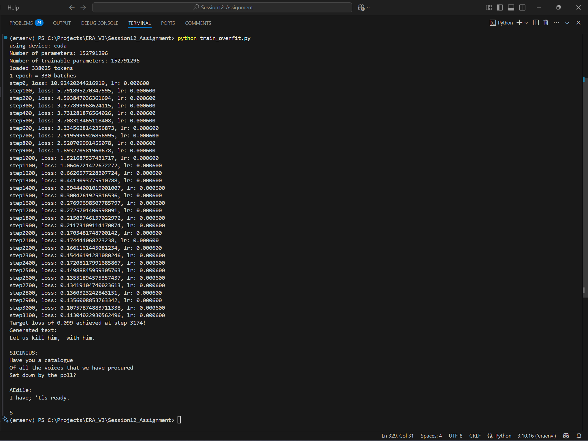

# NanoGPT Shakespeare Trainer

This repository contains an implementation of a 124M parameter decoder-only transformer model trained on Shakespeare text. The model is based on the GPT-2 architecture and was intentionally overfitted to demonstrate viability of this transformer architecture.

## Model Architecture

```Python
   GPT(
   (transformer): ModuleDict(
      (wte): Embedding(50257, 768)
      (wpe): Embedding(1024, 768)
      (drop): Dropout(p=0.0, inplace=False)
      (h): ModuleList(
         (0-15): 16 x Block(
         (ln_1): LayerNorm((768,), eps=1e-05, elementwise_affine=True)
         (attn): CausalSelfAttention(
            (c_attn): Linear(in_features=768, out_features=2304, bias=True)
            (c_proj): Linear(in_features=768, out_features=768, bias=True)
            (attn_dropout): Dropout(p=0.0, inplace=False)
            (resid_dropout): Dropout(p=0.0, inplace=False)
         )
         (ln_2): LayerNorm((768,), eps=1e-05, elementwise_affine=True)
         (mlp): MLP(
            (c_fc): Linear(in_features=768, out_features=3072, bias=True)
            (gelu): GELU(approximate='tanh')
            (c_proj): Linear(in_features=3072, out_features=768, bias=True)
            (dropout): Dropout(p=0.0, inplace=False)
         )
         )
      )
      (ln_f): LayerNorm((768,), eps=1e-05, elementwise_affine=True)
   )
   (lm_head): Linear(in_features=768, out_features=50257, bias=False)
   )
```

- **Type**: Decoder-only transformer (GPT-2 style)
- **Parameters**: 152,791,296 (152M)
- **Layers**: 16 transformer blocks
- **Heads**: 12 attention heads per block
- **Embedding dimension**: 768
- **Context window**: 1024 tokens
- **Vocabulary**: 50,257 tokens (GPT-2 tokenizer)

## Training Approach

The model was trained on a Shakespeare text dataset with the explicit goal of overfitting to showcase memorization capabilities. Key training details:

- **Optimizer**: AdamW with β₁=0.9, β₂=0.95
- **Learning rate**: Constant 6e-4 (no decay)
- **Batch size**: 16 tokens per batch
- **Context length**: 64 tokens
- **Training strategy**: Repeated exposure to a subset of the data

## Training Progress

Below is the visualization of the training progress showing loss reduction over time:



## Modifications for Overfitting

To achieve successful overfitting (target loss of 0.099), the following modifications were made:

1. **Removed regularization**: 
   - Set dropout to 0.0 throughout the network
   - Eliminated weight decay (set to 0.0)

2. **Optimized for memorization**:
   - Disabled gradient clipping
   - Removed label smoothing from loss function
   - Used constant high learning rate with no decay
   - Focused training on a smaller subset of data with repeated iterations

3. **Training methodology**:
   - Cycled through a limited portion of the dataset repeatedly
   - Continued training until target loss was achieved
   - Monitored progress with comprehensive logging including ETA predictions

## Sample Generation

The overfitted model can reproduce the Shakespeare text with high fidelity when given prompts from the training data. Example generation:

```
Input: "Let us kill him, "
Output: 
   Let us kill him,  with him.

   SICINIUS:
   Have you a catalogue
   Of all the voices that we have procured
   Set down by the poll?

   AEdile:
   I have; 'tis ready.
```

## Implementation Details

The model is implemented in PyTorch and follows the original GPT architecture with:
- Causal self-attention mechanism
- Layer normalization
- MLP blocks with GELU activation
- Learned positional embeddings
- Weight tying between input embeddings and output projection

## Usage

To train the model:
```
python train_overfit.py
```